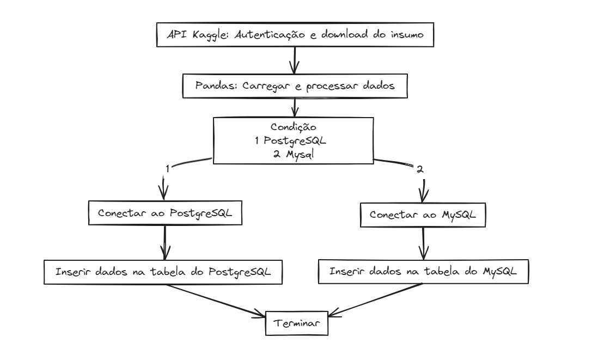

# Projeto ETL (Extração, Transformação e Carga) com Pandas e Banco de Dados

Este é um projeto que demonstra um processo de ETL (Extração, Transformação e Carga) de dados usando a linguagem de programação Python, a biblioteca Pandas e bancos de dados relacionais como MySQL ou PostgreSQL.

## Objetivo

O objetivo deste projeto é extrair dados de conjuntos de dados disponíveis no Kaggle, realizar transformações nos dados usando a biblioteca Pandas e, em seguida, carregar os dados transformados em um banco de dados MySQL ou PostgreSQL.

## Tecnologias Utilizadas

- Python
- Pandas
- Kaggle API (https://github.com/Kaggle/kaggle-api)
- SQLAlchemy
- MySQL ou PostgreSQL

## Estrutura do Projeto

- **src/**: Contém os arquivos do código-fonte do projeto.
  - `main.py`: Arquivo principal do projeto, contendo o código para realizar o ETL.
- **data/**: Diretório para armazenar os dados baixados do Kaggle.
- `requirements.txt`: Arquivo contendo as dependências do projeto.
- `README.md`: Este arquivo README.

## Como Executar o Projeto

1. Clone este repositório em sua máquina local.
2. Instale as dependências do projeto executando `pip install -r requirements.txt`.
3. Certifique-se de ter o Python e os drivers necessários para o banco de dados instalados em sua máquina.
4. Configure suas variáveis de ambiente conforme necessário para autenticação no Kaggle e conexão com o banco de dados.
5. Execute o script principal `main.py` para iniciar o processo de ETL.

## Contribuindo

Contribuições são bem-vindas! Sinta-se à vontade para abrir uma issue para relatar bugs, sugestões ou enviar um pull request com melhorias.

## Licença

Este projeto está licenciado sob a [MIT License](link-para-a-licenca).
